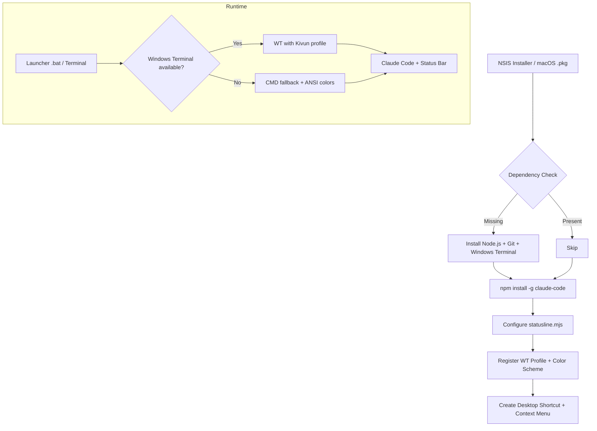

<p align="center">
  
</p>

<p align="center">
  <a href="LICENSE"></a>
  
  
  
  <a href="https://github.com/noambrand/kivun-terminal/releases/latest"></a>
</p>

<h3 align="center">Zero-to-Claude in 2 minutes. Installer, status bar, and launcher for Claude Code on Windows & macOS.</h3>

<p align="center">
  <a href="#-quick-start">Quick Start</a> &bull;
  <a href="#-why-launchpad-cli">Why Launchpad CLI?</a> &bull;
  <a href="#-status-bar">Status Bar</a> &bull;
  <a href="#-architecture">Architecture</a> &bull;
  <a href="#-configuration">Configuration</a> &bull;
  <a href="docs/CHANGELOG.md">Changelog</a> &bull;
  <a href="TROUBLESHOOTING.md">Troubleshooting</a>
</p>

---

## Why Launchpad CLI?

|  | Manual Setup | Launchpad CLI |
|---|---|---|
| **Install Node.js, Git, Claude Code** | Find downloads, run 3 installers, configure PATH | Handled automatically |
| **Terminal theme** | Edit Windows Terminal JSON by hand | One checkbox in the wizard |
| **Status bar** (model, context %, usage limits) | Write your own statusline script, configure settings.json | Pre-installed and configured |
| **Desktop shortcut + right-click menu** | Create shortcuts manually, edit registry | Included |
| **Folder picker** | `cd` into every project | GUI picker or right-click any folder |
| **Multi-language support** | Configure manually | One setting in `config.txt` |
| **Time to first prompt** | 30+ minutes | ~2 minutes |

## Quick Start

### Windows

1. **[Download `ClaudeCode_Launchpad_CLI_Setup.exe`](https://github.com/noambrand/kivun-terminal/releases/latest)**
2. Run as Administrator — the wizard auto-detects what's already installed
3. Double-click the **"ClaudeCode Launchpad CLI"** desktop shortcut
4. Start coding with Claude

### macOS

1. **[Download the `.pkg` installer](https://github.com/noambrand/kivun-terminal/releases/latest)**
2. Double-click it, allow in **System Settings > Privacy & Security**, then run again
3. Open **Terminal** and type `claude`
4. Start coding with Claude

> **First time?** You'll need a Claude Pro/Max subscription or [Anthropic API key](https://console.anthropic.com).

## Status Bar

A two-line live status bar at the bottom of every session:

> **BookWriter** | 🟢 Sonnet 4.6 | Context 🟩🟩🟩🟩🟩⬜⬜⬜⬜⬜ 51% | tokens: 284K | 24:13
>
> Session 🟨🟨🟨🟨🟨🟨🟨🟨⬜⬜ 77% resets in 4h15m &nbsp;|&nbsp; Weekly 🟩🟩⬜⬜⬜⬜⬜⬜⬜⬜ 16% resets in 6d18h

| Field | What it shows |
|-------|---------------|
| **Model** | Active Claude model (color-coded: green = Opus, yellow = Sonnet/Haiku) |
| **Context** | % of context window consumed (green/yellow/red) |
| **Tokens** | Combined input + output tokens this session |
| **Session / Weekly** | Usage limit % with countdown to reset |

## Architecture



## Tech Stack

| Component | Technology | Purpose |
|-----------|-----------|---------|
| Windows installer | NSIS | Silent/wizard install with dependency detection |
| macOS installer | pkgbuild | .pkg with postinstall script via Homebrew |
| Launcher | Batch / Shell | Folder picker, flag passing, WT/CMD fallback |
| Terminal profile | Windows Terminal JSON Fragment | Custom "Noam" color scheme (#C8E6FF) |
| Status bar | Node.js (`statusline.mjs`) | Live model, context, and usage display |
| Config scripts | Node.js | WT settings injection, statusline setup |
| CI/CD | GitHub Actions | Automated macOS .pkg builds |

## Configuration

Edit `%LOCALAPPDATA%\Kivun\config.txt` (Windows) after installation:

```ini
RESPONSE_LANGUAGE=english     # 24+ languages supported
TERMINAL_COLOR=kivun          # "kivun" or "default"
CLAUDE_FLAGS=                 # e.g. --continue
```

## Contributing

Contributions are welcome! Areas where help is especially useful:

- **Linux installer** -- no Linux support yet
- **Installer testing** -- different Windows/macOS versions and locales

Fork the repo, make your changes, and open a PR.

## Community

Submitted to awesome lists (pending review):

- [awesome-claude-code](https://github.com/jqueryscript/awesome-claude-code/pull/166)
- [awesome-claude](https://github.com/webfuse-com/awesome-claude/pull/159)
- [awesome-claude-plugins](https://github.com/quemsah/awesome-claude-plugins/pull/85)

## License

[MIT](LICENSE)

---

<p align="center">
  <strong>Made by <a href="https://github.com/noambrand">Noam Brand</a></strong>
  <br><br>
  <a href="https://github.com/noambrand"></a>
  <a href="mailto:noambbb@gmail.com"></a>
</p>
