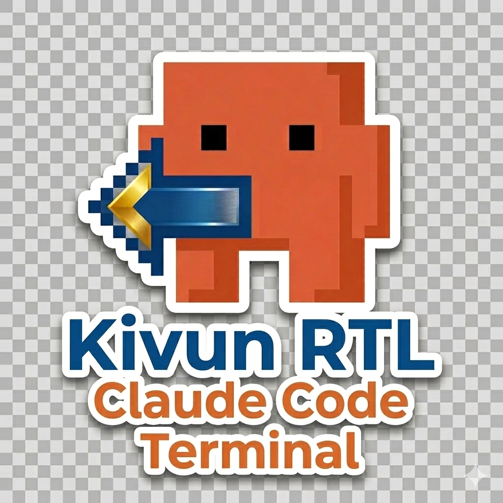

  

# Kivun Terminal

**Claude Code installer for Windows and macOS**

2-minute setup to get Claude Code working instead of 30+ minutes of manual configuration.

## [Download Latest Release](https://github.com/noambrand/kivun-terminal/releases/latest)

## What You Get

- **Automatic installation** - Node.js + Claude Code installed and configured automatically
- **Clean, modern terminal** - light blue theme with dark text (Windows Terminal on Windows)
- **One-click launch** - double-click the desktop shortcut and Claude Code starts immediately (Windows)
- **Folder picker** - choose a project folder and Claude opens right there, no `cd` needed (Windows)
- **Right-click any folder** - "Open with Kivun Terminal" context menu integration (Windows)

## Installation

### Windows

1. **[Download](https://github.com/noambrand/kivun-terminal/releases/latest)** `Kivun_Terminal_Setup.exe`
2. Run as Administrator - follow the wizard
3. Double-click the "Kivun Terminal" desktop shortcut

The installer auto-detects what you already have and skips it.

### macOS

1. **[Download](https://github.com/noambrand/kivun-terminal/releases/latest)** `Kivun_Terminal_Setup_<version>.pkg`
2. Double-click the `.pkg` file and follow the installer
3. Open Terminal and run `claude`

The installer sets up Homebrew (if needed), Node.js, Git, and Claude Code. On first run, macOS may show an "unidentified developer" warning — right-click the `.pkg` and select Open.

## Requirements

- **Windows**: Windows 10/11
- **macOS**: macOS 12 (Monterey) or later
- [Anthropic API Key](https://console.anthropic.com)

## Documentation

- [Quick Start](docs/QUICK_START.md)
- [Changelog](docs/CHANGELOG.md)

## License

MIT

---
**Made by [Noam Brand](https://github.com/noambrand)**
